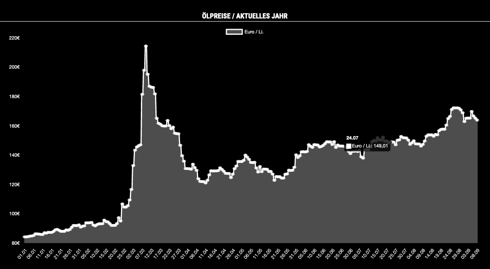

# MMM-Oelpreise
Chart module for [MagicMirror²](https://github.com/MichMich/MagicMirror). The module displays oil prices for the current year based on [Chart.js](http://www.chartjs.org/) and the API of [heizoel24.de](https://www.heizoel24.de/charts/heizoel).

## Screenshot


## Installation

In your terminal, go to your MagicMirror's Module folder:
````
cd ~/MagicMirror/modules
````

Clone this repository:
````
git clone https://github.com/eckonator/MMM-Oelpreise.git
````

Install dependencies:
````
cd ~/MagicMirror/modules/MMM-Oelpreise
````

````
npm install
````

After MagicMirror Update, maybe it can help to run:
````
cd ~/MagicMirror/modules/MMM-Oelpreise
./node_modules/.bin/MagicMirror-rebuild
````

Configure the module in your `config.js` file.

## Using the module

To use this module, add it to the modules array in the `config/config.js` file:
````javascript
modules: [
    {
        module: 'MMM-Oelpreise',
        position: 'middle_center',
        header: 'Ölspreise / aktuelles Jahr',
        config: {
            amount         : '3000',  // amount in liter
            updateInterval : 86400, // 1 day in seconds
            width          : 1200,   // width in pixel
            height         : 800    // height in pixel
        }
    }
]
````

## Configuration options

The following property can be configured:

| Option         | Description                | Default value |
|----------------|----------------------------|:-------------:|
| amount         | Amount in liter            |  ```3000```   |
| updateInterval | Update Interval in seconds |  ```86400```  |
| width          | Chart width in px.         |  ```1200```   |
| height         | Chart height in px.        |   ```800```   |


